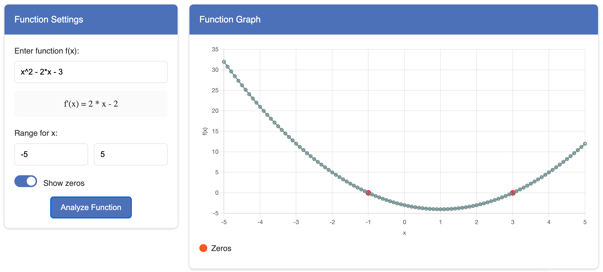

# mathvista
Interactive Function Analyzer

## Supported Operations
- **Basic operations**: +, -, *, /, ^ (power)
- **Functions**: sin, cos, tan, sqrt, log, ln, abs
- **Constants**: pi, e

## Example Functions
- `x^2 - 2*x - 3` (quadratic function)
- `sin(x)` (trigonometric function)
- `1/x` (rational function)
- `ln(x)` (logarithmic function)
- `e^x` (exponential function)
- `x^3 - 6*x^2 + 11*x - 6` (cubic function)
- `sqrt(x)` (square root function)
